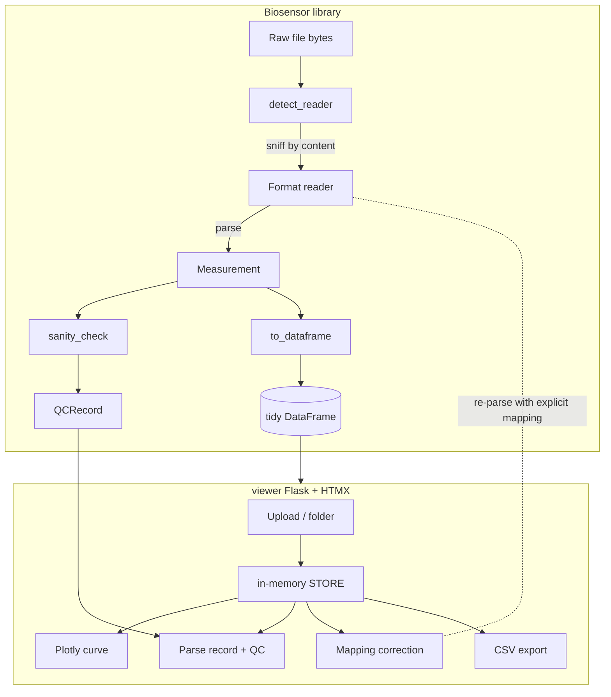

# Biosensor Architecture

Two layers: a library that turns instrument files into one schema, and a local
viewer that wraps the library for visual verification. The viewer depends on
the library; the library has no knowledge of the viewer.

## Flow

## Library components

| Component | File | Contract |
|---|---|---|
| Schema | `schema.py` | `Measurement` (data) and `QCRecord` (sanity state) dataclasses. `Measurement.__post_init__` enforces equal-length potential/current and matching cycle length |
| Readers | `readers/*.py` | Each implements `sniff(raw, filename) -> bool` (cheap, content-based) and `parse(raw, filename) -> Measurement` |
| Detection | `readers/detect.py` | Tries each reader's `sniff` in order; generic CSV last (most permissive). Raises `UnsupportedFormatError` if none match |
| Column inference | `readers/columns.py` | Maps header names and filename conventions to schema fields; exposed to the viewer for the confirm/correct flow |
| Safety limits | `readers/base.py` | 25 MB byte ceiling, 200,000-row ceiling; raises `FileTooLargeError` |
| Error taxonomy | `readers/base.py` | `ParseError` / `UnsupportedFormatError` / `FileTooLargeError`, and `classify_error()` mapping any exception to one of `ERROR_CATEGORIES` |
| QC heuristic | `qc.py` | `sanity_check(measurement) -> QCRecord`; curve-shape checks only, versioned (`heuristic_version`) independently of the schema |
| Public API | `core.py` | `load`, `batch_load`, `to_dataframe`, and the `LoadResult` / `BatchLoadResult` / `BatchError` result types |

### Why QC is a separate record

The sanity heuristic is a first pass, not a fixed truth. Keeping `QCRecord`
outside `Measurement` means the heuristic can change version, or be dropped
once it's reliable, without altering a single measurement field or breaking a
downstream frame.

## Viewer components

Flask backend, HTMX for partial updates, Plotly for the curve. Single process,
single user, in-memory only.

| Route group | File | Purpose |
|---|---|---|
| `/`, `/parse`, `/batch` | `app.py` | Load a file or folder into the in-memory `STORE` |
| `/file/<id>`, `/file/<id>/review` | `app.py` | Parse record, QC display, manual status override |
| `/file/<id>/mapping/*` | `app.py`, `mapping.py` | Infer, preview, and apply a corrected column mapping by re-parsing raw bytes |
| `/dataframe`, `/file/<id>/dataframe` | `app.py` | CSV export (batch or single) with formula-injection defusing |
| `/ledger`, `/ledger/file/<id>` | `app.py` | Batch ledger view |
| Plot / preview | `plotting.py`, `preview.py` | Build the Plotly figure and the dataframe preview |

### Mapping correction

When auto-inference maps columns wrong (potential and current swapped, for
example), the user picks columns by index and the viewer re-parses the raw
bytes against that explicit mapping, bypassing the header-keyword inference
that got it wrong. A live preview shows the corrected frame before it's
applied. This path is meaningful only for delimited-text sources; PalmSens
JSON has no columns to remap.

## Trust boundary

The viewer opens files from other researchers' instruments, a wider trust
boundary than a tool fed only your own exports. Every uploaded file is
untrusted: detection is content-based, byte and row limits bound parsing cost,
no reader executes embedded macros or scripts, any parse failure degrades to a
per-file error, and strings derived from file content (filenames, sample IDs,
technique labels) are sanitized before display and CSV export, including a
CSV-formula-injection guard.

## Tracing

Key actions (file parse, batch upload, mapping correction, CSV export) are
instrumented with [traceact](https://github.com/traceact/traceact), writing to
`data/traces/traces.jsonl` for local debugging. Tracing isn't required to run
the app.

Built by Mo Shehu — mohammedshehu.com
